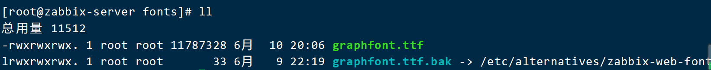
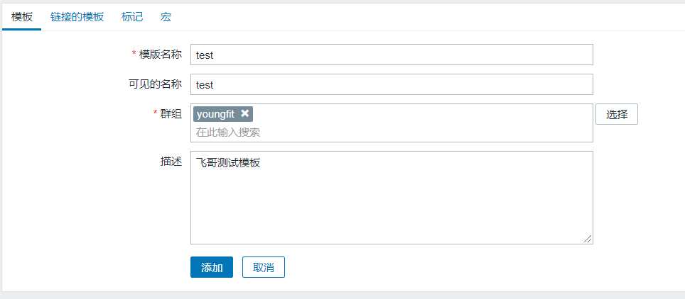
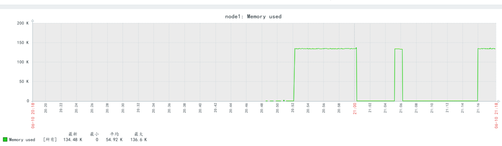
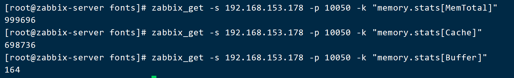
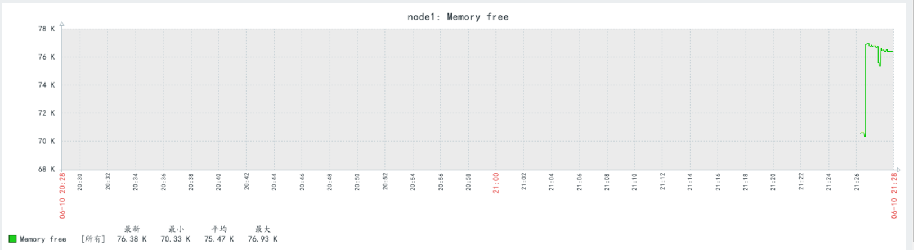
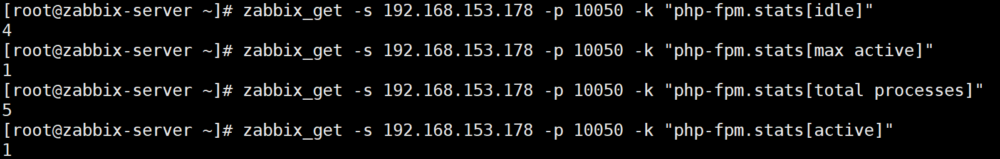
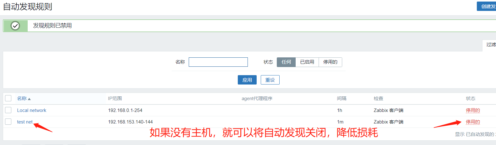
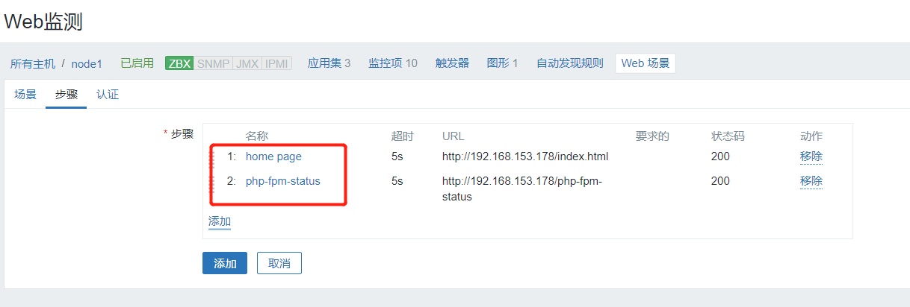

## 1、Zabbix可视化

##### 1、 简介

　随着大量数据流入Zabbix，对用户来说，如果他们可以通过可视化图表查看数据而不仅仅是看到数字，那会更容易了解发生了什么事情。

图表可以使您一目了然地掌握数据流，关联问题，发现某些事情何时开始，或者表现其可能会出现问题

##### 2、 自定义图形（Graphs）

　　自定义图形中可以集中展示多个时间序列的数据流。支持“**线状图**(normal)”、“**堆叠面积图**(stacked)”、“**饼图**(pie)” 和“**分离型饼图**(exploded)”四种不同形式的图形。
　　具体的设置过程如下：
　　进入 配置 ---> 主机 ---> node1 ---> 图形，选择右上角创建图形：


查看图形：


**2个类似的监控项，也可关联到1个图形当中**

比如：创建2个类似的监控项


再克隆


再次创建图形（包含以上2个监控项）：


去查看图形：


##### 3、聚合图形

在Zabbix的聚合图形页面上，你可以把从各种图形聚合到一起，以便在单个屏幕上快速查看。构建聚合图形非常简单只管


效果图：


##### 4、幻灯片


##### 5、解决字体乱码问题:

在windows的“控制面板”中，找到1款字体；


上传到Zabbix监控端


```shell
[root@zabbix-server ~]# cd /usr/share/zabbix/assets/fonts
[root@zabbix-server fonts]# ls
graphfont.ttf
[root@zabbix-server fonts]# mv graphfont.ttf graphfont.ttf.bak
[root@zabbix-server fonts]# ls
graphfont.ttf.bak    
[root@zabbix-server fonts]# mv /root/simkai.ttf .
[root@zabbix-server fonts]# ls
graphfont.ttf.bak  simhei.ttf
[root@zabbix-server fonts]# mv simkai.ttf graphfont.ttf
[root@zabbix-server fonts]# chmod 777 graphfont.ttf
```




##### 6、模板

模板是可以方便地应用于多个主机的一组实体。 实体可以是：

- 监控项
- 触发器
- 图形
- 应用
- 聚合图形
- 自动发现规则
- web场景

当模板链接到主机时，模板的所有实体（项目，触发器，图形，…）都将添加到主机。模板直接分配给每个单独的主机（而不是主机组）。

模板通常用于为特定服务或应用程序（如Apache，MySQL，PostgreSQL，Postfix …）分组实体，然后应用于运行这些服务的主机。

使用模板的另一个好处是当所有主机都需要更改时。只需要在模板上更改某些内容将会将更改应用到所有链接的主机。

因此，使用模板是减少工作量并简化Zabbix配置的好方法。




将 模板 关联到 主机


再次去查看主机的监控项：


去  最新数据 中也可看到：


注意：1、一个主机可以链接多个模板.
　　    2、如果我们有多个主机，同时这些主机也在一个主机组里，这样的话，我们只需要在这个主机组里添加模板。


移除模板链接

一定要点击 清除链接并清理；这样才会把之前保留的数据清除；减缓数据库压力；


## 2、用户参数（自定义监控）

##### 1、介绍和用法

① 介绍

自定义用户参数，也就是自定义监控项的键值

有时，你可能想要运行一个代理检查，而不是Zabbix的预定义

你可以**编写一个命令**来**检索需要的数据**，并将其包含在agent代理配置文件("UserParameter"配置参数)的**用户参数**中

```shell
用法格式 syntax
UserParameter=<key>,<command>
一个用户参数也包含一个键
在配置监控项时，key是必需的
注意:需要重新启动 agent 服务 
```

##### 2、用法展示

（1）修改agent 端的配置，设置用户参数

①自己需要查找的参数的命令

```shell
[root@zabbix-agent-none1 ~]# free | awk '/^Mem/{print $3}'
```


② 修改agent配置文件，把查找参数的命令设为用户参数

```shell
[root@zabbix-agent-none1 ~]# cd /etc/zabbix/zabbix_agentd.d/
[root@zabbix-agent-none1 zabbix_agentd.d]# vim memory_usage.conf
UserParameter=memory.used,free | awk '/^Mem/{print $3}'
```

③ 重启agent 服务

```shell
[root@zabbix-agent-none1 zabbix_agentd.d]# systemctl restart zabbix-agent.service
```

（2）在zabbix-server 端，查询

```shell
[root@zabbix-server ~]# zabbix_get -s 192.168.153.178 -k memory.used -p 10050
```

（3）在监控上，设置一个item监控项，使用这个用户参数

配置-->主机-->none1-->监控项-->创建监控项


（4）查询 最新数据 中的 图形



## 3、用法升级（自定义监控）

#### （1）修改agent 端的配置，设置用户参数

① 命令行查询参数的命令


② 修改配置文件，把查找参数的命令设为用户参数

```shell
[root@zabbix-agent-none1 zabbix_agentd.d]# ls
memory_usage.conf  userparameter_mysql.conf
[root@zabbix-agent-none1 zabbix_agentd.d]# vim memory_usage.conf  ----继续添加
UserParameter=memory.stats[*],cat /proc/meminfo | awk '/^$1/{print $$2}'     --添加到文件中注意去掉反斜杠
[root@zabbix-agent-none1 zabbix_agentd.d]# systemctl restart zabbix-agent.service
```

```shell
注意：$$2：表示不是前边调位置参数的$1，而是awk 的参数$2
注意：$1是调用前边的[*]，位置参数，第一个参数
```

####  （2）在zabbix-server 端，查询使用这个用户参数的key

```shell
传参:
[root@zabbix-server fonts]# zabbix_get -s 192.168.153.178 -p 10050 -k "memory.stats[MemTotal]"
999696
[root@zabbix-server fonts]# zabbix_get -s 192.168.153.178 -p 10050 -k "memory.stats[Cache]"
698736
[root@zabbix-server fonts]# zabbix_get -s 192.168.153.178 -p 10050 -k "memory.stats[Buffer]"
164
```



#### （3）在监控上，设置一个item监控项，使用这个用户参数

① 添加Memory Total 的item监控项，使用**memory.stats[MemTotal]** 的用户参数


 

② clone 克隆Memory Total 创建Memory Free 的监控项，使用**memory.stats[MemFree]** 用户参数


#### （4）上面2个监控项的graph 图形

① memory total


② memory free



实战案例1：

## 4、使用用户参数监控php-fpm 服务的状态

在agent 端：192.168.153.178

#### （1）下载，设置php-fpm 、nginx

```
[root@zabbix-agent-node1 ~]# yum -y install php-fpm
[root@zabbix-agent-node1 ~]# vim /etc/php-fpm.d/www.conf     #修改如下
user = nginx
group = nginx
pm.status_path = /php-fpm-status    #php-fpm 的状态监测页面 ，#打开注释并修改
ping.path = /ping      #ping 接口，存活状态是否ok   #打开注释
ping.response = pong    #响应内容pong  #打开注释
[root@zabbix-agent-none1 ~]# yum -y install nginx
[root@zabbix-agent-none1 ~]# useradd nginx
[root@zabbix-agent-none1 ~]# systemctl start php-fpm
```

#### （2）设置nginx ，设置代理php，和php-fpm的状态页面匹配

```
[root@zabbix-agent-none1 ~]# vim /etc/nginx/nginx.conf
server {
        listen       80 default_server;
        server_name  localhost;
        root         /usr/share/nginx/html;

        # Load configuration files for the default server block.
        include /etc/nginx/default.d/*.conf;

        location / {
        }
        
        location ~ \.php$ {
            fastcgi_pass   127.0.0.1:9000;
            fastcgi_index  index.php;
            fastcgi_param  SCRIPT_FILENAME  $document_root$fastcgi_script_name;
            include        fastcgi_params;
        }
        location ~* /(php-fpm-status|ping) {
            fastcgi_pass   127.0.0.1:9000;
            fastcgi_index  index.php;
            fastcgi_param  SCRIPT_FILENAME  $fastcgi_script_name;
            include        fastcgi_params;

            access_log off;   #访问这个页面就不用记录日志了
       }
}
```

```
[root@zabbix-agent-node1 ~]# nginx -t 
nginx: the configuration file /etc/nginx/nginx.conf syntax is ok
nginx: configuration file /etc/nginx/nginx.conf test is successful
[root@zabbix-agent-node1 ~]# nginx -s reload
```

#### （3）在agent 端，设置用户参数

① 查询 curl 192.168.153.178/php-fpm-status


```
pool – fpm池子名称，大多数为www
process manager – 进程管理方式,值：static, dynamic or ondemand. dynamic
start time – 启动日期,如果reload了php-fpm，时间会更新
start since – 运行时长
accepted conn – 当前池子接受的请求数
listen queue – 请求等待队列，如果这个值不为0，那么要增加FPM的进程数量
max listen queue – 请求等待队列最高的数量
listen queue len – socket等待队列长度
idle processes – 空闲进程数量
active processes – 活跃进程数量
total processes – 总进程数量
max active processes – 最大的活跃进程数量（FPM启动开始算）
max children reached - 大道进程最大数量限制的次数，如果这个数量不为0，那说明你的最大进程数量太小了，请改大一点。
slow requests – 启用了php-fpm slow-log，缓慢请求的数量
```

② 设置

```shell
[root@zabbix-agent-node1 ~]# cd /etc/zabbix/zabbix_agentd.d/
[root@zabbix-agent-node1 zabbix_agentd.d]# vim php_status.conf     ---添加
UserParameter=php-fpm.stats[*],curl -s http://192.168.246.226/php-fpm-status | awk '/^$1/{print $$NF}'
#设置用户参数为php-fpm.stats[*]，$1为第一个参数；$$NF为awk中的参数
```

 ③ 重启服务

```
[root@zabbix-agent-node1 zabbix_agentd.d]# systemctl restart zabbix-agent
```

####  （4）在zabbix-server 端，查询使用这个用户参数的key

```
[root@zabbix-server ~]# zabbix_get -s 192.168.153.178 -p 10050 -k "php-fpm.stats[idle]"
4
[root@zabbix-server ~]# zabbix_get -s 192.168.153.178 -p 10050 -k "php-fpm.stats[max active]"
1
[root@zabbix-server ~]# zabbix_get -s 192.168.153.178 -p 10050 -k "php-fpm.stats[total processes]"
5
[root@zabbix-server ~]# zabbix_get -s 192.168.153.178 -p 10050 -k "php-fpm.stats[active]"
1
```



#### （5）创建一个模板，在模板上创建4个item监控项，使用定义的用户参数

① 创建一个模板


② 在模板上配置items 监控项，使用刚定义的用户参数

fpm.stats[total processes]


③ 再clone克隆一个items监控项

**fpm.stats[active processes]**


#### （6）host主机链接模板


（7）查看graph 图形

① php-fpm total processes


② php-fpm active processes


（8）模板导出和导入，可以给别人使用。或者使用别人的


自己定义用户参数的文件，也不要忘记导出

```
/etc/zabbix/zabbix_agentd.d/php_status.conf
```

## 5、Network discovery 网络发现(自动发现)

### 1、介绍

（1）介绍

```shell
网络发现：zabbix server扫描指定网络范围内的主机；
网络发现是zabbix 最具特色的功能之一，它能够根据用户事先定义的规则自动添加监控的主机或服务等
优点：
加快Zabbix部署
简化管理
在快速变化的环境中使用Zabbix，而不需要过度管理
```

（2）发现方式：

```shell
ip地址范围；
可用服务（ftp, ssh, http, ...）
zabbix_agent的响应；
snmp_agent的响应；
```

（3）网络发现通常包含两个阶段：discovery发现 和actions动作

```shell
① discovery：
Zabbix定期扫描网络发现规则中定义的IP范围；
② actions：网络发现中的事件可以触发action，从而自动执行指定的操作，把discvery events当作前提条件；
添加/删除主机
启用/禁用host
向组中添加主机
移除组中的主机
从模板链接主机或取消链接
```

=======================================================

### 2、配置网络发现Network discovery

（1）利用第二台用于可被扫描发现的主机----192.168.153.143

① 安装agent 端的包

```shell
[root@zabbix-agent-node2 ~]#  rpm -Uvh https://repo.zabbix.com/zabbix/5.0/rhel/7/x86_64/zabbix-release-5.0-1.el7.noarch.rpm
[root@zabbix-agent-node2 ~]# yum -y install zabbix-agent zabbix-sender
[root@zabbix-agent-node2 ~]# systemctl stop firewalld
[root@zabbix-agent-node2 ~]# setenforce 0
```

② 设置agent 配置，可以把之前设置好的none1的配置传过来

```shell
[root@zabbix-agent-node2 ~]# vim /etc/zabbix/zabbix_agentd.conf
```

```shell
Server=192.168.153.147

ServerActive=192.168.153.147

Hostname=zabbix-agent-none2 #只需修改hostname
```

```shell
[root@zabbix-agent-none2 ~]# visudo       #修改sudo的配置,添加如下信息
```

```shell
zabbix ALL=(ALL) NOPASSWD: ALL
```


④ 开启服务

```shell
[root@zabbix-agent-none2 ~]# systemctl start zabbix-agent
```

（2）设置自动发现规则discovery

配置--自动发现--创建自动发现规则


注释：在zabbix-server端


或者，换个键值:


② 更新间隔：1h就好，不要扫描太过频繁，扫描整个网段，太废资源；这里为了实验，设为1m

 （3）自动发现成功


### 3、设置自动发现discovery 的动作action

a) 创建


① 设置A条件，自动发现规则=test net

② 设置B条件，自动发现状态=up


③ 要做什么操作

添加主机到监控

自动链接Template OS Linux 到此host


d) 启用动作，查看效果

确实已经生效，添加主机成功，模板链接成功


（5）如果自己需要添加的主机已经扫描添加完成，就可以关闭网络扫描了，因为太耗资源



## 6、web页面监控

### 1、介绍

（1）介绍

要使用Web监控，您需要定义web场景。Web场景包括一个或多个HTTP请求或“步骤”。Zabbix server根据预定义的命令周期性的执行这些步骤。如果主机是通过代理监控的话，这些步骤将由代理执行。

从 Zabbix2.2 开始，Web 场景和监控项，触发器等一样，是依附在主机/模版上的。这意味着 web 场景也可以创建到一个模板里，然后应用于多个主机。

任何web场景会收集下列数据：

- 整个场景中所有步骤的平均下载速度
- 失败的步骤数量
- 最近的错误信息

对于web场景的所有步骤，都会收集下列数据：

- 每秒下载速度
- 响应时间
- 响应码

### 2、创建设置web场景

配置--主机--none1--web场景--创建web场景

（1）创建


（2）配置web 监测

① 点击步骤，设置web page web页面


a) 设置名为home page，URL为http://192.168.153.178/index.html 的web页面


b) 设置名为fpm status，URL为http://192.168.153.178/php-fpm-status 的web页面


c) 设置2个web页面成功



### 3、查看测试


## 7、实现分布式 zabbix proxy 监控

### 1、实验前准备

- ntpdate 192.168.153.147 同步时间

- 关闭防火墙，selinux

- proxy主机设置主机名 hostnamectl set-hostname zbproxy.youngfit.com

- vim /etc/hosts 每个机器都设置hosts，以解析主机名；DNS也行

### 2、环境配置（4台主机）

| 机器名称              | IP配置          | 服务角色  |
| --------------------- | --------------- | --------- |
| zabbix-server         | 192.168.153.147 | 监控      |
| node1                 | 192.168.153.178 | 被监控端  |
| node2                 | 192.168.153.143 | 被监控端  |
| zbxproxy.youngfit.com | 192.168.153.148 | 代理proxy |

zabbix-server 直接监控一台主机 node1

zabbix-server 通过代理 proxy 监控 node2

所有机器配置解析

```shell
监控端
[root@zabbix-server ~]# hostnamectl set-hostname zabbix-server
[root@zabbix-server ~]# cat /etc/hosts
192.168.153.147 zabbix-server
192.168.153.148 zbxproxy.youngfit.com
192.168.153.143 zabbix-agent-node2

代理端
[root@192 ~]# hostnamectl set-hostname zbxproxy.youngfit.com
[root@zbxproxy ~]# cat /etc/hosts
192.168.153.147 zabbix-server
192.168.153.148 zbxproxy.youngfit.com
192.168.153.143 zabbix-agent-node2

被监控端
[root@node1 ~]# hostnamectl set-hostname zabbix-agent-node2
[root@node1 ~]# cat /etc/hosts
192.168.153.147 zabbix-server
192.168.153.148 zbxproxy.youngfit.com
192.168.153.143 zabbix-agent-node2
```

### 3、在 zbxproxy.qfedu.com 上配置 mysql

##### 1、安装配置 mysql5.7

```shell
[root@zbxproxy ~]# wget https://dev.mysql.com/get/mysql80-community-release-el7-3.noarch.rpm
[root@zbxproxy ~]# rpm -ivh mysql80-community-release-el7-3.noarch.rpm
[root@zbxproxy ~]# vim /etc/yum.repos.d/mysql-community.repo
```


```shell
[root@zbxproxy ~]# yum -y install mysql-server mysql
```

##### 2、启动数据库服务

```
[root@zbxproxy ~]#  systemctl start mysqld
```


##### 3、顺便更改密码

```shell
[root@zbxproxy ~]# mysqladmin -uroot -p'wTp0z:pkkweI' password 'FeiGe@2021'
```

##### 4、创建数据库 和 授权用户

```shell
mysql> create database zbxproxydb character set 'utf8';
mysql> grant all on zbxproxydb.* to 'zbxproxyuser'@'192.168.153.%' identified by 'ZBXproxy@2021';
mysql> grant all on zbxproxydb.* to 'zbxproxyuser'@'localhost' identified by 'ZBXproxy@2021';
mysql> flush privileges;
```

### 4、在 zbxproxy.youngfit.com 上下载zabbix 相关的包，主要是代理proxy的包

```shell
[root@zbxproxy ~]# rpm -Uvh https://repo.zabbix.com/zabbix/5.0/rhel/7/x86_64/zabbix-release-5.0-1.el7.noarch.rpm
[root@zbxproxy ~]# yum -y install zabbix-proxy-mysql zabbix-get zabbix-agent zabbix-sender
```

1、导入数据

zabbix-proxy-mysql 包里带有，导入数据的文件

```
[root@zbxproxy ~]# rpm -ql zabbix-proxy-mysql
```


```
[root@zbxproxy ~]# cp /usr/share/doc/zabbix-proxy-mysql-5.0.12/schema.sql.gz  .
[root@zbxproxy ~]# gzip -d schema.sql.gz 
[root@zbxproxy ~]# mysql -uroot -p'FeiGe@2021' zbxproxydb < schema.sql 
```

2、查看数据已经生成


### 5、配置 proxy 端

```
[root@zbxproxy ~]# vim /etc/zabbix/zabbix_proxy.conf
```


```
Server=192.168.153.147        # server 的IP
ServerPort=10051             # server 的端口

Hostname=zbxproxy.qfedu.com  # 主机名
ListenPort=10051             # proxy自己的监听端口
EnableRemoteCommands=1       # 允许远程命令
LogRemoteCommands=1          # 记录远程命令的日志

# 数据的配置
DBHost=localhost
DBName=zbxproxydb
DBUser=zbxproxyuser
DBPassword=ZBXproxy@2021

ConfigFrequency=30      # 多长时间，去服务端拖一次有自己监控的操作配置；为了实验更快的生效，这里设置30秒，默认3600s
DataSenderFrequency=1   # 每一秒向server 端发一次数据，发送频度
```

2、开启服务 

```shell
[root@zbxproxy ~]# systemctl start zabbix-proxy
```

### 6、配置node2端允许proxy代理监控

如未安装zabbix-agent，先安装

```shell
[root@zabbix-agent-node2 ~]# yum install zabbix-agent zabbix-sender -y
```

```shell
[root@zabbix-agent-node2 ~]# vim /etc/zabbix/zabbix_agentd.conf
Server=192.168.153.148,192.168.153.147      #写proxy的地址即可，监控端可选
ServerActive=192.168.153.148,192.168.153.147
Hostname=zabbix-agent-node2
[root@zabbix-agent-node2 ~]# systemctl restart zabbix-agent #启动服务
```

### 7、把代理加入监控 server 创建配置 agent 代理

1、创建 agent 代理


### 8、创建node1 主机并采用代理监控


### 9、创建item监控项

##### 1、随便创一个监控项 CPU Switches


**下面可以在被监控端下载个Apache,进行监控，查看是否生效**

被监控端下载Apache

```shell
[root@zabbix-agent-node2 ~]# yum -y install httpd
[root@zabbix-agent-node2 ~]# systemctl start httpd
```

在监控端页面创建监控tcp 80端口的监控项


在zabbix-server端测试，查看是否能获取的key值

```shell
[root@zbxproxy ~]# zabbix_get  -s 192.168.153.143 -k net.tcp.listen[80] -p 10050
1
```


创建触发器


```
测试触发器效果
[root@zabbix-agent-node2 ~]# systemctl stop httpd
```


可见，触发器也能生效

但是现在还未学习发送报警消息

等学会了设置自动发送报警消息

再回来，测试是否可以正常报警

我这边已经经过实验，可以报警，报警图片如下图：


