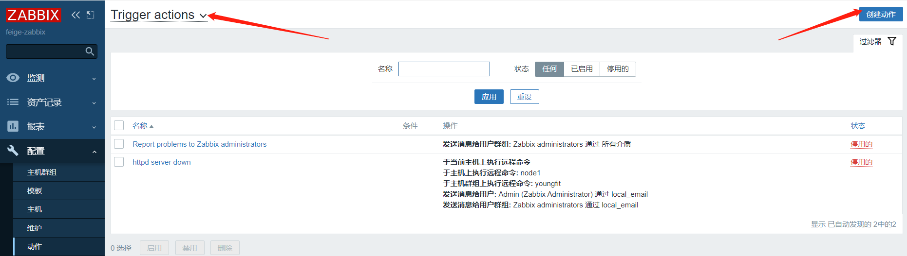
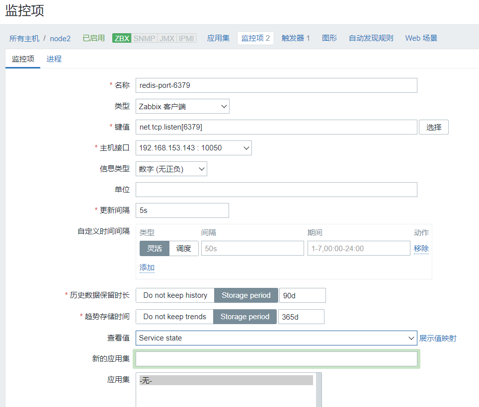

## Zabbix邮箱自动监控报警实战

邮件系统简要介绍：
电子邮件系统包括两个组件：

MUA(Mail User  Agent,邮件用户代理）和MTA(Mail Transport  Agent,邮件传送代理 postfix）;

MUA是邮件系统为用户提供的可以读写邮件的界面；而MTA是运行在底层，能够处理邮件的收发工作的程序;

mail和mailx即为负责查看、编写邮件和向MTA发送邮件的MUA。mailx是mail的功能加强版。 

```shell
1.注册163邮箱
2.登陆网页邮箱设置客户端授权密码
```

#### 注册邮箱

注册地址：https://mail.163.com/


#### 开启SMTP服务


TBELSWWIEOYTKPYF

#### 监控端测试邮箱

  **server服务器端：**

安装MUA软件：mailx

```shell
阿里云的yum源可以下载
[root@zabbix-server ~]# yum install mailx -y
[root@zabbix-server ~]# mailx -V 
12.5 7/5/10
注：使用新的方式--利用公网邮件服务器发送报警，需要关闭postfix服务
[root@zabbix-server ~]# systemctl stop postfix
```

配置公网邮箱信息：

```shell
[root@zabbix-server ~]# vim /etc/mail.rc  ---在最后添加如下：
```

```shell
set from=feigeyoungfit@163.com（邮箱地址） 
set smtp=smtp.163.com（smtp服务器） 
set smtp-auth-user=feigeyoungfit@163.com(用户名) 
set smtp-auth-password=TBELSWWIEOYTKPYF（这里是邮箱的授权密码） 
set smtp-auth=login
```

使用mailx发邮件的方式：

```shell
方式1：echo "正文内容" | mailx -s "邮件标题" 收件箱Email
方式2：mailx -s "邮件标题" 收件箱Email，回车按CTRL+D发送
参数：
-v ：显示发送的详细信息
```

手动发送邮件测试：

```shell
[root@zabbix-server ~]# mailx -v -s 'hello' 'feigeyoungfit@163.com'
123
123
EOT
```

手写邮件内容 （回车，然后ctrl+d正常结束)

手动使用mailx发送邮件测试结果：


zabbix添加邮件报警功能:

配置 zabbix 的邮件报警功能需要以下三个角色的参与。

```shell
1、 示警媒体(Media)
2、 触发器(Triggers)
3、 动作(Action)
```

```shell
示警媒体:
    指的是 zabbix 采用何种方式进行报警,目前 Zabbix 支持的示警媒体包括邮件、脚本、Jabber、短信。jabber是linux下一种即时通讯工具。
    
触发器:
    指的是当监控对象达到某个条件或条件集合的时候,触发 Zabbix 产生事件。
    
动作:
    指的是 Zabbix 产生对应事件后,它通过示警媒体发送报警。

接下来,我们配置一个邮件报警功能的范例。效果是当redis端口挂掉则触发报警,管理员将会收到一封 Zabbix 发出的报警邮件。
```

示警媒体的配置:

```shell
首先需要配置 Zabbix 的邮件功能。
点击 管理->报警媒介类型->创建媒体类型
```

1.然后在页面中填入你的报警媒介类型信息，例如下图所示:

```shell
注：脚本名称任意，存放于/usr/lib/zabbix/alertscripts
(生产上的测试服放这：/usr/local/zabbix/share/zabbix/alertscripts）
```

```
名称：sendmail.sh                   //名称任意
类型：脚本
脚本名称：sendmail.sh      
脚本参数：                          //一定要写，否则可能发送不成功
    {ALERT.SENDTO}              //照填，收件人变量
    {ALERT.SUBJECT}             //照填，邮件主题变量，变量值来源于‘动作’中的‘默认接收人’
    {ALERT.MESSAGE}           //照填，邮件正文变量，变量值来源于‘动作’中的‘默认信息’

配置完成后,不要忘记点击存档,保存你的配置。
```


邮件内容模板：

发现问题：


邮件内容模板：

问题恢复：


```
默认信息：邮件的主题
主机: {HOST.NAME1}
时间: {EVENT.DATE} {EVENT.TIME}
级别: {TRIGGER.SEVERITY}
触发: {TRIGGER.NAME}
详情: {ITEM.NAME1}:{ITEM.KEY1}:{ITEM.VALUE1}
状态: {TRIGGER.STATUS}
项目：{TRIGGER.KEY1}
事件ID：{EVENT.ID}
```


2.修改zabbix服务端配置文件＆编写脚本：指定脚本的存储路径:

```shell
[root@zabbix-server ~]# vim /etc/zabbix/zabbix_server.conf
```


```shell
 AlertScriptsPath=/usr/lib/zabbix/alertscripts
```

编写邮件脚本:

脚本仍是发送邮件，只不过换了1种方式

```shell
[root@zabbix-server ~]# cd /usr/lib/zabbix/alertscripts/
[root@zabbix-server alertscripts]# vim sendmail.sh
#!/bin/sh 
#export.UTF-8
echo "$3" | sed s/'\r'//g | mailx -s "$2" $1
```

```shell
$1:接受者的邮箱地址：sendto
$2:邮件的主题：subject
$3:邮件内容：message
```

```
监控端测试：
[root@zabbix-server alertscripts]# echo 'feige' | mailx -s nihao feigeyoungfit@163.com
```


修改权限：

```shell
[root@zabbix-server alertscripts]# chmod u+x sendmail.sh && chown zabbix.zabbix sendmail.sh
或者：
[root@zabbix-server alertscripts]# chmod +x sendmail.sh
```

修改admin用户的报警媒介：

用户默认是没有关联报警媒介的，设置后就可以接收报警消息了。  

接下来,设置接受报警用户的电子邮件

点击：管理->报警媒介类型->Admin->报警媒介->添加


此时：

我们的node2节点上，有监控80端口的监控项，有关联到此监控项的触发器，还缺1个动作

#### 创建动作




#### 测试

在被监控端操作：

```
[root@zabbix-agent-node2 ~]# systemctl stop httpd
```

可以看到，Zabbix检测到问题之后，会执行动作


报警邮件接收成功：


```
[root@zabbix-agent-node2 ~]# systemctl start httpd
```

可看到，问题已恢复


恢复邮件接收成功


## Zabbix企业微信自动监控报警

这次我们来监控node2节点的redis服务，来呈现项目效果；

1、被监控节点node2

2、node2节点 监控项（监控redis6379端口）

3、node2节点触发器（关联到“redis6379端口”）

#### 被监控节点node2下载redis

```
[root@zabbix-agent-node2 ~]# yum -y install epel-release ; yum -y install redis
[root@zabbix-agent-node2 ~]# vim /etc/redis.conf
```

允许所有人来访问，这样zabbix监控端才能检测到redis 6379端口是否存活


```
[root@zabbix-agent-node2 ~]# systemctl start redis
```

#### 创建对应监控项



#### 创建对应触发器


#### 测试触发器效果

被监控node2关闭redis服务


#### zabbix 微信报警【监控端】

手机端下载“企业微信”


#### 企业登录后台【pc】


```
应用：报警机器人
AgentID 		1000017
Secret 			QyASUhjgIRaHHOHKdPKrPpGm8bxlNUrXLqU3toK6E4Q
企业 CorpID      wwd5348195e1cdd809
部门id 		   1
```

#### 测试报警机器人


#### python报警监控脚本

```mariadb
需要修改脚本中的四个信息：
self.__corpid = 'wwd5348195e1cdd809' //公司的corpid
self.__secret = '2QvlfpUxh4k-JeIuxVNmkh2N7ijfkCs1lzb4Tkgr6xQ' //应用的secret
'toparty':1, //部门id
'agentid':"1000017", //应用id
```

```mariadb
[root@zabbix-server ~]# vim /usr/lib/zabbix/alertscripts/wechat.py
#!/usr/bin/env python
# -*- coding: utf-8 -*-

import urllib,urllib2,json
import sys
reload(sys)
sys.setdefaultencoding( "utf-8" )


class WeChat(object):
        __token_id = ''
        # init attribute
        def __init__(self,url):
                self.__url = url.rstrip('/')
                self.__corpid = 'wwd5348195e1cdd809'
                self.__secret = 'QyASUhjgIRaHHOHKdPKrPpGm8bxlNUrXLqU3toK6E4Q'


        # Get TokenID
        def authID(self):
                params = {'corpid':self.__corpid, 'corpsecret':self.__secret}
                data = urllib.urlencode(params)


                content = self.getToken(data)


                try:
                        self.__token_id = content['access_token']
                        # print content['access_token']
                except KeyError:
                        raise KeyError


        # Establish a connection
        def getToken(self,data,url_prefix='/'):
                url = self.__url + url_prefix + 'gettoken?'
                try:
                        response = urllib2.Request(url + data)
                except KeyError:
                        raise KeyError
                result = urllib2.urlopen(response)
                content = json.loads(result.read())
                return content


        # Get sendmessage url
        def postData(self,data,url_prefix='/'):
                url = self.__url + url_prefix + 'message/send?access_token=%s' % self.__token_id
                request = urllib2.Request(url,data)
                try:
                        result = urllib2.urlopen(request)
                except urllib2.HTTPError as e:
                        if hasattr(e,'reason'):
                                print 'reason',e.reason
                        elif hasattr(e,'code'):
                                print 'code',e.code
                        return 0
                else:
                        content = json.loads(result.read())
                        result.close()
                return content

        # send message
        def sendMessage(self,touser,message):
                self.authID()
                data = json.dumps({
                        'touser':touser,
                        'toparty':1,
                        'msgtype':"text",
                        'agentid':"1000017",
                        'text':{
                                'content':message
                        },
                        'safe':"0"
                },ensure_ascii=False)


                response = self.postData(data)
                print response

if __name__ == '__main__':
        a = WeChat('https://qyapi.weixin.qq.com/cgi-bin')
        a.sendMessage(sys.argv[1],sys.argv[3])
```


```mariadb
监控脚本测试：
注：ShiYuFei为上图的企业成员微信名 test为标题 双引号内为内容，标题和内容均可自定义
[root@zabbix-server alertscripts]# python wechat.py ShiYuFei test-zabbi "千锋云计算飞哥 Zabbix5.0
课程与时俱进
千锋教育
做真实的自己
用良心做教育"
{u'invaliduser': u'', u'errcode': 0, u'errmsg': u'ok'}
```


#### zabbix 创建告警媒介

创建报警媒介

注：(以哪种方式发送报警信息,短信，脚本等等)


设置报警消息模板和恢复消息模板


5.7 zabbix 添加告警用户

这里我们使用普通用户，来看如何设置，主要注意权限的问题

```
创建用户组：web-group，包含feige、alice...等用户
创建用户：feige、alice...等用户，并关联到微信告警
希望的结果是：发微信到组web-group，组中的用户feige、alice都能收到
```

#### 创建用户组


确保web-group用户组，对youngfit主机群组有读写的权限，这样web-group组


#### 创建用户


#### Zabbix 添加报警动作


#### 微信测试报警

被监控端操作

```mariadb
[root@zabbix-agent-node2 ~]# systemctl stop httpd
```


```
[root@zabbix-agent-node2 ~]# systemctl start httpd
```


## Zabbix 钉钉自动监控报警

#### 创建钉钉报警机器人


上处也可以：


把webhook的地址记录下来

#### 创建报警脚本

```shell
[root@zabbix-server ~]# cd /usr/lib/zabbix/alertscripts
[root@zabbix-server alertscripts]# vim dingding.py
#!/usr/bin/python
# -*- coding: utf-8 -*-
# Author: sxdswc999 
import requests
import json
import sys
import os
 
headers = {'Content-Type': 'application/json;charset=utf-8'}
api_url = ""  #机器人的Webhook地址
 
def msg(text):
    json_text= {
     "msgtype": "text",
        "text": {
            "content": text
        },
        "at": {
            "atMobiles": [
                ""    #手机号
            ],
            "isAtAll": False
        }
    }
    print requests.post(api_url,json.dumps(json_text),headers=headers).content
     
if __name__ == '__main__':
    text = sys.argv[1]
    msg(text)
[root@zabbix-server alertscripts]# chmod +x dingding.py
```

安装python-pip和requests库

```shell
[root@zabbix-server alertscripts]# yum -y install epel-release
[root@zabbix-server alertscripts]# yum -y install python-pip
[root@zabbix-server alertscripts]# pip install requests
```


#### 测试脚本是否可行

```shell
[root@zabbix-server alertscripts]# ./dingding.py "千锋云计算飞哥
Zabbix5.0 钉钉报警成功
课程与时俱进
满足企业需求
做真实的自己
用良心做育
主机:Zabbix-Server
时间:2021-06-13
详情：升级课程"
{"errcode":0,"errmsg":"ok"}
```


pc端接收成功：


移动端App接收成功：


#### 创建新的报警媒介：


```
主机: {HOST.NAME1}
时间: {EVENT.DATE} {EVENT.TIME}
级别: {TRIGGER.SEVERITY}
触发: {TRIGGER.NAME}
详情: {ITEM.NAME1}:{ITEM.KEY1}:{ITEM.VALUE1}
状态: {TRIGGER.STATUS}
项目：{TRIGGER.KEY1}
事件ID：{EVENT.ID}
```


#### 关联媒介

将feige用户关联到此媒介：


#### 设置动作

这里直接更改一下redis动作里面的媒介，看效果更快捷


#### 钉钉报警测试

```
[root@zabbix-agent-node2 ~]# systemctl stop redis
```

PC端接收成功：


移动端APP接收成功：


```
[root@zabbix-agent-node2 ~]# systemctl start redis
```


