## Zabbix  JVM监控

### 1、被监控节点安装JDK和Tomcat

监控节点：192.168.153.147

被监控节点：192.168.153.178

准备JDK

```shell
[root@zabbix-agent-node1 ~]# tar -xvzf jdk-8u211-linux-x64.tar.gz  -C /usr/local/
[root@zabbix-agent-node1 local]# cd /usr/local
[root@zabbix-agent-node1 local]# mv jdk1.8.0_211/ java
export JAVA_HOME=/usr/local/java   #指定java安装目录
export PATH=$JAVA_HOME/bin:$JAVA_HOME/jre/bin:$PATH    #用于指定java系统查找命令的路径
export CLASSPATH=.:$JAVA_HOME/lib:$JAVA_HOME/jre/lib:$JAVA_HOME/lib/tools.jar  #类的路径，在编译运行java程序时，如果有调用到其他类的时候，在classpath中寻找需要的类。
[root@zabbix-agent-node1 ~]# source /etc/profile
[root@zabbix-agent-node1 ~]# java -version
```

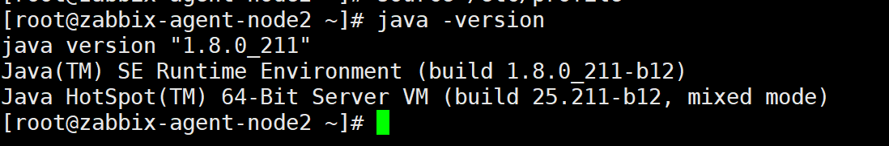

准备Tomcat

```shell
[root@zabbix-agent-node1 ~]# tar -xvzf apache-tomcat-8.5.45.tar.gz  -C /usr/local/
[root@zabbix-agent-node1 ~]# cd /usr/local/
[root@zabbix-agent-node1 local]# mv apache-tomcat-8.5.45/ tomcat
[root@zabbix-agent-node1 local]# /usr/local/tomcat/bin/startup.sh
```

访问tomcat web页面：

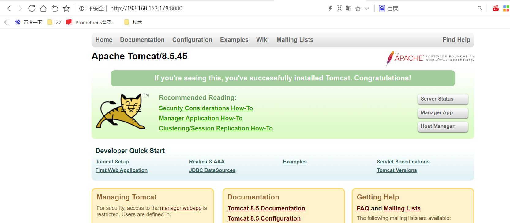

### 2、被监控节点安装zabbix-java-gateway

```shell
[root@zabbix-agent-node1 ~]# rpm -Uvh https://repo.zabbix.com/zabbix/5.0/rhel/7/x86_64/zabbix-release-5.0-1.el7.noarch.rpm
[root@zabbix-agent-node1 ~]# yum install zabbix-java-gateway -y
[root@zabbix-agent-node1 ~]# vim /etc/zabbix/zabbix_java_gateway.conf
LISTEN_IP="0.0.0.0"
LISTEN_PORT=10052
START_POLLERS=50
TIMEOUT=30

要启用debuginfo存储库，请编辑/etc/yum.repos.d/zabbix.repo文件。 对于zabbix-debuginfo存储库，将enabled = 0更改为enabled = 1
[zabbix-debuginfo]
name=Zabbix Official Repository debuginfo - $basearch
baseurl=http://repo.zabbix.com/zabbix/5.0/rhel/7/$basearch/debuginfo/
enabled=0
gpgkey=file:///etc/pki/rpm-gpg/RPM-GPG-KEY-ZABBIX-A14FE591
gpgcheck=1
[root@zabbix-agent-node1 ~]# yum install zabbix-debuginfo   #可以不安装
[root@zabbix-agent-node1 ~]# systemctl restart zabbix-java-gateway
[root@zabbix-agent-node1 ~]# systemctl enable zabbix-java-gateway
[root@zabbix-agent-node1 ~]# lsof -i:10052
```

### 3、配置zabbix-server调用java gateway


```shell
[root@zabbix-server alertscripts]# vim /etc/zabbix/zabbix_server.conf
JavaGateway=192.168.153.178  #这里写java-gateway的ip地址
JavaGatewayPort=10052        #这里写java-gateway主机占用的端口号
StartJavaPollers=20          #启动多少个进程去轮询 java gateway
```

### 4、验证java pollers

```
[root@zabbix-server alertscripts]# systemctl restart zabbix-server
```

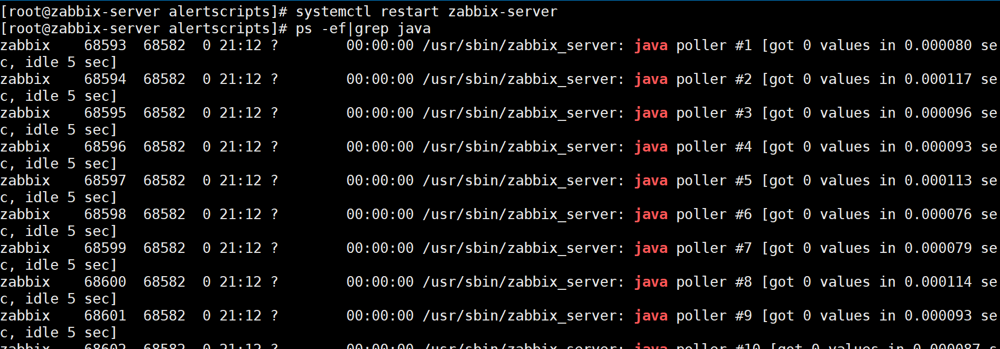

### 5、Tomcat开启JMX监控

**JMX在java中，定义了应用程序以及网络管理和监控体系结构、设计模式、应用程序接口以及服务，通常使用JMX来监控系统运行的状态**

进入Tomcat/bin目录，修改catalina.sh，找到如下内容“#—–Execute The Requested Command”，在其下方添加以下配置，此配置不需要用户名、密码

```
CATALINA_OPTS="$CATALINA_OPTS
-Dcom.sun.management.jmxremote
-Djava.rmi.server.hostname=192.168.153.178  #tomcat所在服务器的ip地址
-Dcom.sun.management.jmxremote.port=12345  #端口号，是你要开启的监控端口号。
-Dcom.sun.management.jmxremote.ssl=false  #ssl，false表示不使用ssl链接
-Dcom.sun.management.jmxremote.authenticate=false"  #authenticate，false表示不使用监控，即不需要用户名和密码
```

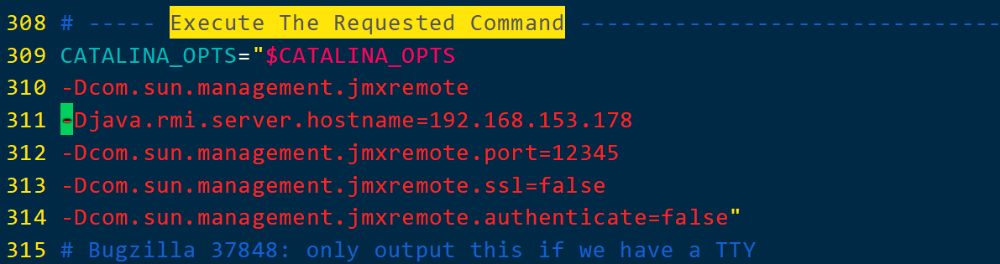

```shell
修改了Tomcat配置文件，需要重启Tomcat
[root@zabbix-agent-node1 tomcat]# ps -ef|grep tomcat
[root@zabbix-agent-node1 tomcat]# kill -9 3301
[root@zabbix-agent-node1 tomcat]# ps -ef|grep tomcat
root        3371    1168  0 21:31 pts/0    00:00:00 grep --color=auto tomcat
[root@zabbix-agent-node1 tomcat]# /usr/local/tomcat/bin/startup.sh 
```

### 6、通过jsconsole验证JMX数据(可选操作)：

在windows安装JDK，安装过程略，安装完成之后，点击安装目录的jconsole.exe，比如D:\Jdk1.8\bin

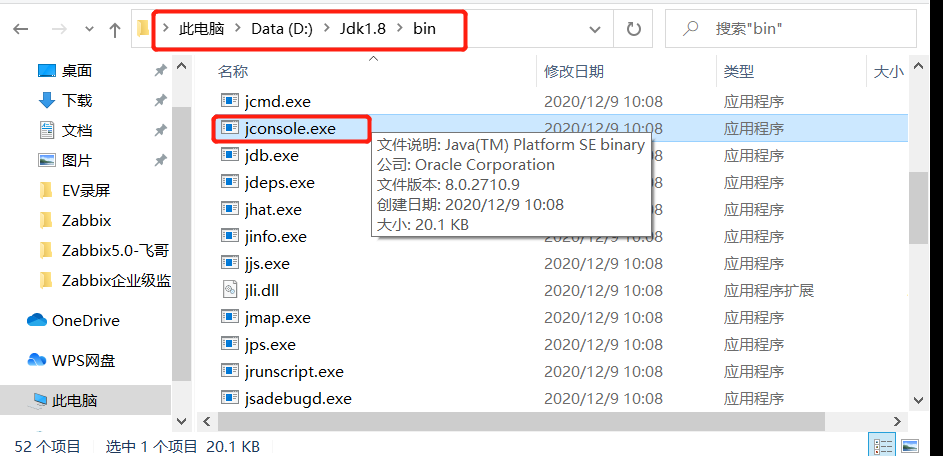

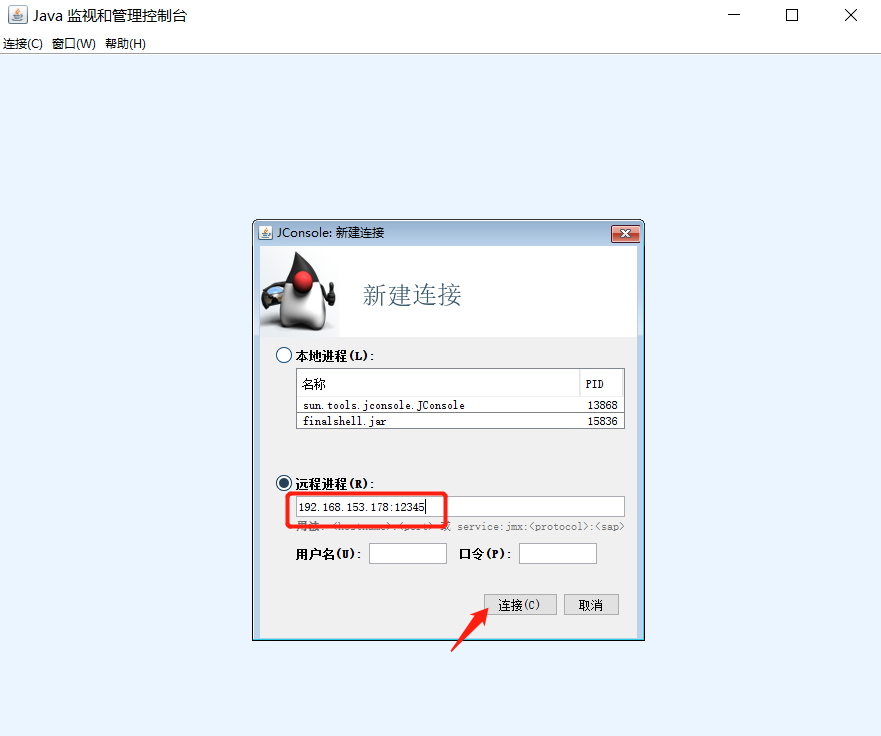

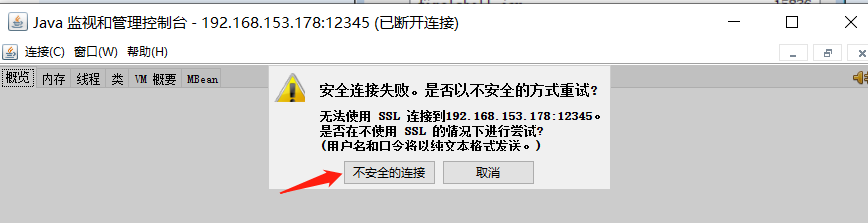

### 7、验证连接（可选操作）

连接成功后，会显示当前JMX数据：

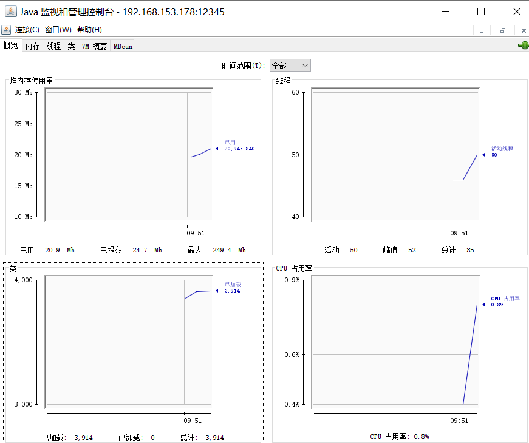

### 8、Zabbix server平台给对应被监控端添加JMX监控

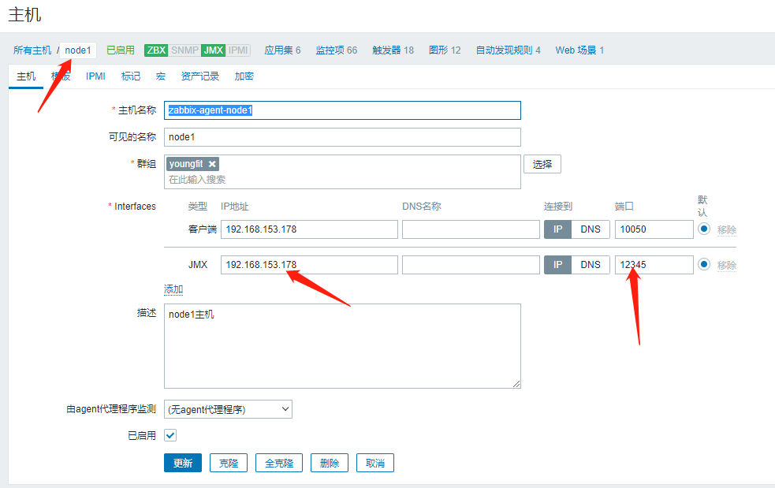

关联JMX相应模板

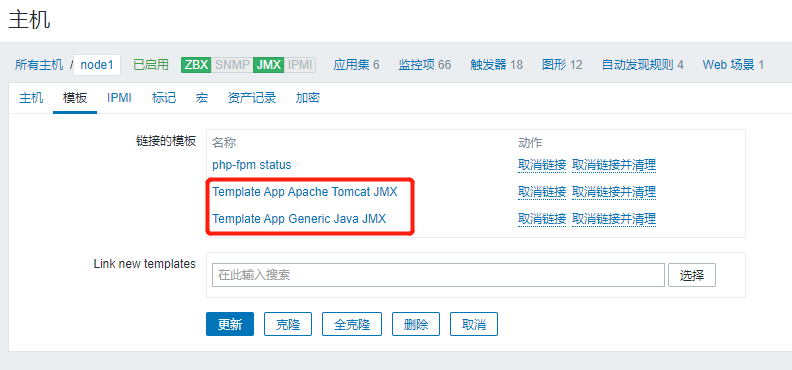

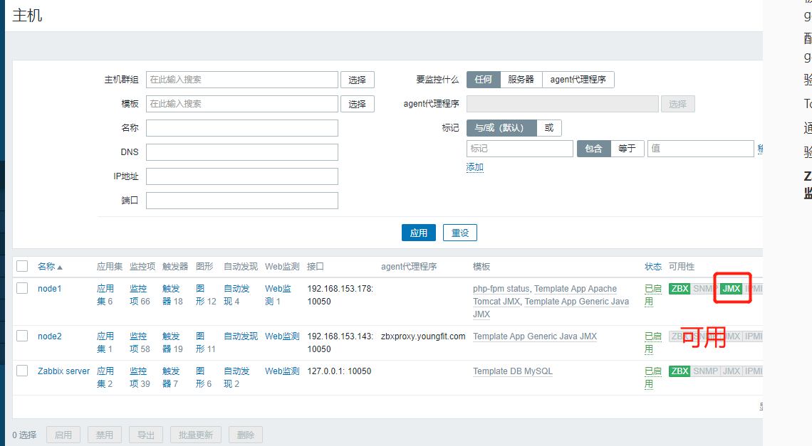

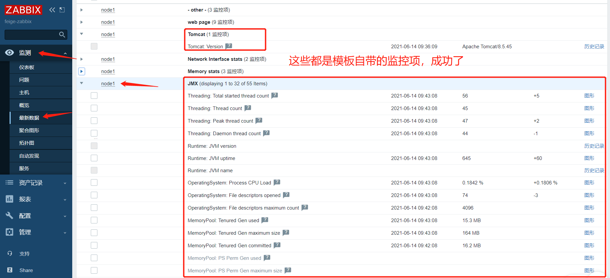

## Zabbix SNMP监控

### SNMP简介

```
简单网络管理协议（SNMP，Simple Network Management Protocol）构成了互联网工程工作小组（IETF，Internet Engineering Task Force）定义的Internet协议族的一部分。该协议能够支持网上管理系统，用以监测连接到网络上的设备是否有任何引起管理上关注的情况。

SNMP的基本思想：为不同种类的设备、不同厂家生产的设备、不同型号的设备，定义为一个统一的接口和协议，使得管理员可以是使用统一的外观面对这些需要管理的网络设备进行管理。通过网络，管理员可以管理位于不同物理空间的设备，从而大大提高网络管理的效率，简化网络管理员的工作。

SNMP协议主要由两大部分构成：SNMP管理站和SNMP代理。SNMP管理站是一个中心节点，负责收集维护各个SNMP元素的信息，并对这些信息进行处理，最后反馈给网络管理员；而SNMP代理是运行在各个被管理的网络节点之上，负责统计该节点的各项信息，并且负责与SNMP管理站交互，接收并执行管理站的命令，上传各种本地的网络信息。


SNMP的工作方式：管理员需要向设备获取数据，所以SNMP提供了【读】操作；管理员需要向设备执行设置操作，所以SNMP提供了【写】操作；设备需要在重要状况改变的时候，向管理员通报事件的发生，所以SNMP提供了【Trap】操作。
SNMP采用UDP协议在管理端和agent之间传输信息。 SNMP采用UDP 161端口接收和发送请求，162端口接收trap，执行SNMP的设备缺省都必须采用这些端口。SNMP消息全部通过UDP端口161接收，只有Trap信息采用UDP端口162。

MIB
MIB（Management Information Base）是用于管理通信网络中的实体的数据库。通常与简单网络管理协议（SNMP）相关联，数据库是分层的（树形结构的），并且每个条目通过对象标识符（OID）来寻址。
MIB层次结构可以描述为具有无名根的树，其级别由不同的组织分配。顶级MIB OID属于不同的标准组织，而较低级别的对象ID由关联组织分配。此模型允许跨OSI参考模型的所有层进行管理，扩展到数据库，电子邮件和Java参考模型等应用程序，因为可以为所有此类区域特定信息和操作定义MIB

OID
Object IDentifiers(OID)在计算中，对象标识符或OID是由国际电信联盟（ITU）和ISO / IEC标准化的标识符机制，用于命名具有全局明确持久名称的任何对象，概念或“事物”。
```

### 被监控节点安装snmp软件

```
[root@zabbix-agent-node1 ~]# yum  install net-snmp net-snmp-utils -y
```

有时候我们监控项需要权限，为了测试，先在打开全部查看的权限
修改配置文件/etc/snmp/snmpd.conf

```
[root@zabbix-agent-node1 ~]# vim /etc/snmp/snmpd.conf
```

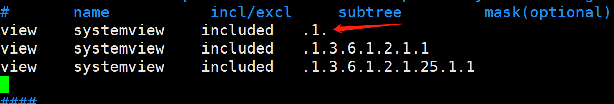

```
[root@zabbix-agent-node1 ~]# systemctl start snmpd
```

### 测试

```
snmpget命令格式
snmpget [COMMON OPTIONS] [-Cf] AGENT OID [OID]...
常用的选项
-v 1|2c|3  表示使用snmp协议的哪个版本，有3个版本，最常用的是2c
-c COMMUNITY		设置口令，一般都是public，如果需要修改可以在配置文件改
```

示例：获取内存大小

```
##.1.3.6.1.2.1.25.2.2.0这个OID是获取内存总量大小的。
[root@zabbix-agent-node1 ~]# snmpget -v 2c -c public 192.168.153.178 .1.3.6.1.2.1.25.2.2.0
```

### 添加SNMP主机

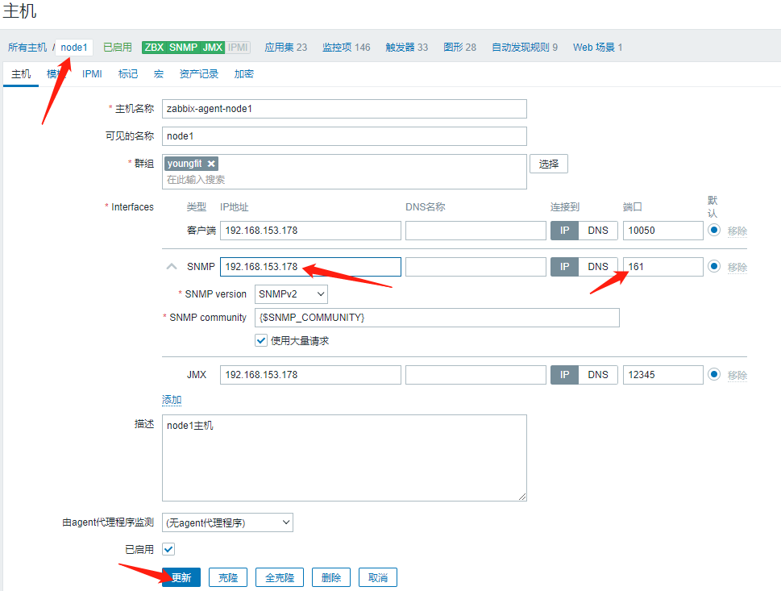

### 为主机添加SNMP模板

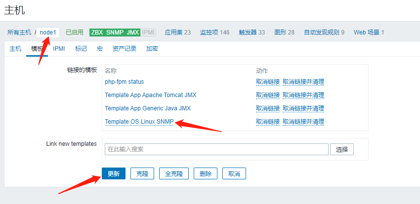

等待一会儿

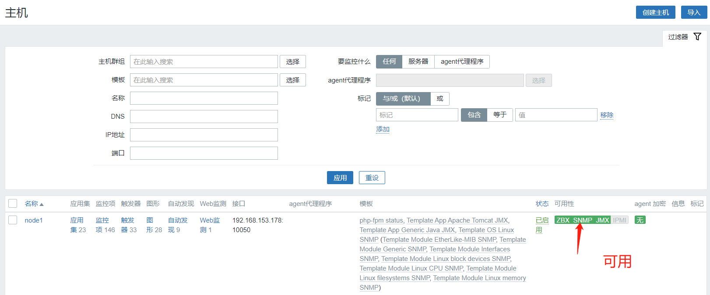

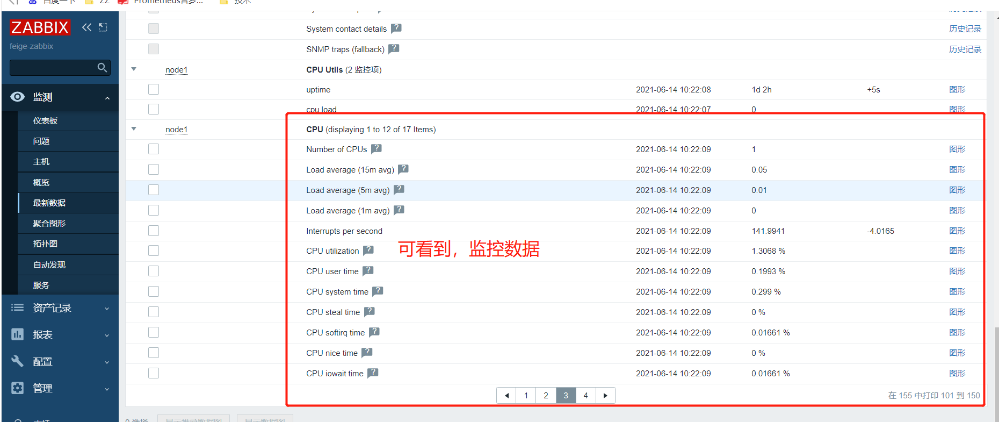

## Zabbix IPMI监控

